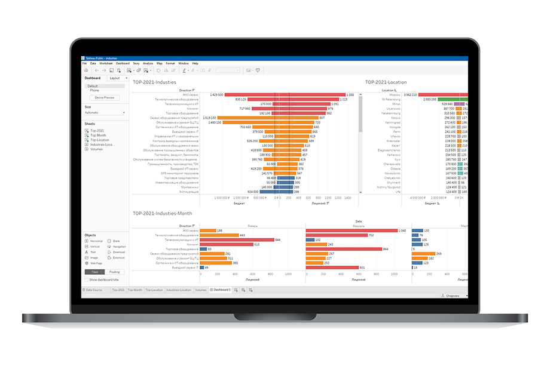

# INHUB - Analytics
   
Программное обепечение для обработки данных с целью их последующего анализа и использования в моделях машинного обучения для предсказания вероятности покупки ПО.  

## Обязательные требования
- Python 3.7+  
- Библиотеки Python: re, nampy, pandas, transliterate  

  